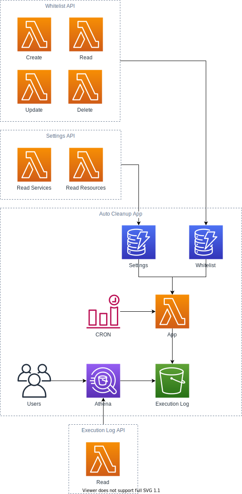

<p align="center">
<a href="https://travis-ci.org/servian/aws-auto-cleanup"></a> <a href="https://www.codacy.com/app/servian/aws-auto-cleanup?utm_source=github.com&utm_medium=referral&utm_content=servian/aws-auto-cleanup&utm_campaign=Badge_Grade"></a> <a href="https://www.codacy.com/app/servian/aws-auto-cleanup?utm_source=github.com&utm_medium=referral&utm_content=servian/aws-auto-cleanup&utm_campaign=Badge_Coverage"></a>
</p>

<p align="center">
Open-source application to programmatically clean your AWS resources based on a whitelist and time to live (TTL) settings
</p>



## Table of Contents

- [Setup](#setup)
  - [Deployment](#deployment)
  - [Removal](#removal)
  - [Configuration](#configuration)
- [Tables](#tables)
- [Execution Log](#execution-log)
- [Web Application](#web-application)
- [Contributing](CONTRIBUTING.md)

## Setup

### Deployment

1.  Install [AWS CLI](https://aws.amazon.com/cli/)

```bash
pip3 install awscli --upgrade --user
```

2.  Configure the AWS CLI following the instruction at [Quickly Configuring the AWS CLI](https://docs.aws.amazon.com/cli/latest/userguide/cli-chap-configure.html#cli-quick-configuration). Ensure the user you're configuring has the appropriate IAM permissions to create Lambda Functions, S3 Buckets, IAM Roles, CloudFormation Stacks and more. Administrators should deploy Auto Cleanup.

3.  Clone Auto Cleanup

```bash
git clone https://github.com/servian/aws-auto-cleanup && cd aws-auto-cleanup
```

4.  Install Auto Cleanup dependencies

```bash
npm install
```

5.  Deploy Auto Cleanup

```bash
serverless deploy [--region <AWS region>] [--aws-profile <AWS CLI profile>]
```

6. Invoke Auto Cleanup

_Note: This will populate the settings and whitelist tables and run a clean in dry run mode_

```bash
serverless invoke --function AutoCleanup [--region <AWS region>] [--aws-profile <AWS CLI profile>] --type Event
```

7. Inspect invocation logs

```bash
serverless logs --function AutoCleanup [--region <AWS region>] [--aws-profile <AWS CLI profile>]
```

### Removal

Auto Cleanup is deployed using the Serverless Framework which under the hood creates an AWS CloudFormation Stack allowing for a clean and simple removal process.

To remove Auto Cleanup from your AWS account, run the following command from the `aws-auto-cleanup` directory.

_Note: This will remove all provisioned resources including the excution logs folder. If you'd rather keep the logs, make a copy prior._

```bash
serverless remove [--region <AWS region>] [--aws-profile <AWS CLI profile>]
```

### Configuration

#### Default Values

When Auto Cleanup runs, it will populate `auto-cleanup-settings` or `auto-cleanup-whitelist` DynamoDB tables from files `app/data/auto-cleanup-settings.json` and `app/data/auto-cleanup-whitelist.json`.

#### Logging

Within the `serverless.yml` file, under `custom` there is a `LOGLEVEL` attribute. By default, the log level is set to `INFO`. This can be changed to `DEBUG`, `INFO`, `WARN`, `ERROR`, `FATAL`, `CRITICAL` based on your logging requirements.

Auto Cleanup will output all resource deletion logs under the `INFO` level and logs of why resources were **not** removed under the `DEBUG` level.

#### Scheduling

Within the `serverless.yml` file, under `functions > AutoCleanup > events > schedule` there is a `RATE` and `enabled` attributes.

You can enable custom scheduling of the Lambda by following the instruction at [Schedule Expressions Using Rate or Cron](https://docs.aws.amazon.com/lambda/latest/dg/tutorial-scheduled-events-schedule-expressions.html).

The `enabled` attribute allows you to quickly enable or disable the scheduling functionality.

## Tables

Auto Cleanup uses two DynamoDB tables `auto-cleanup-settings` and `auto-cleanup-whitelist`.

### Settings

The settings table contains all key-value pair settings used by Auto Cleanup during runtime.

The **resource** map holds all the time to live settings for each service and resource pair. By default, they are all set to 7 days.

The **region** map allows users to turn region scanning on and off to either expand their search or reduce the run-time of Auto Cleanup.

By default, the below settings are automatically inserted when Auto Cleanup is run.

#### Version

Version is used to inform Auto Cleanup if new settings exist in the default data file that should be loaded into DynamoDB. If the version number present in the default data file is greater than the version number stored in the DynamoDB table, the load will commence.

| Key     | Value |
| ------- | ----- |
| Version | x.x   |

#### General

| Key     | Value |
| ------- | ----- |
| Dry Run | True  |

#### Services

The table includes the `clean` attribute which informs Auto Cleanup if the service should be cleaned and the `ttl` attribute which stores the time to live in days for that service resource pair.

| Service           | Resource Type            | Clean | TTL |
| ----------------- | ------------------------ | ----- | --- |
| CloudFormation    | Stacks                   | True  | 7   |
| DynamoDB          | Tables                   | True  | 7   |
| EC2               | Addresses                | True  | N/A |
| EC2               | Instances                | True  | 7   |
| EC2               | Security Groups          | True  | N/A |
| EC2               | Snapshots                | True  | 7   |
| EC2               | Volumes                  | True  | 7   |
| Elastic Beanstalk | Applications             | True  | 7   |
| EMR               | Clusters                 | True  | 7   |
| Glue              | Dev Endpoints            | True  | 7   |
| IAM               | Roles                    | True  | 30  |
| Kinesis           | Streams :new:            | True  | 7   |
| Lambda            | Functions                | True  | 30  |
| RDS               | Instances                | True  | 7   |
| RDS               | Snapshots                | True  | 7   |
| Redshift          | Clusters                 | True  | 7   |
| Redshift          | Snapshots                | True  | 7   |
| S3                | Buckets                  | True  | 30  |
| SageMaker         | Endpoints :new:          | True  | 7   |
| SageMaker         | Notebook Instances :new: | True  | 7   |

#### Regions

The table includes the `clean` attribute which informs Auto Cleanup if the region should be cleaned up or not.

| Region            | Clean |
| ----------------- | ----- |
| af-south-1        | True  |
| ap-east-1         | True  |
| ap-northeast-1    | True  |
| ap-northeast-2    | True  |
| ap-northeast-3 \* | False |
| ap-south-1        | True  |
| ap-southeast-1    | True  |
| ap-southeast-2    | True  |
| ca-central-1      | True  |
| cn-north-1 \*     | False |
| cn-northwest-1 \* | False |
| eu-central-1      | True  |
| eu-north-1        | True  |
| eu-south-1        | True  |
| eu-west-1         | True  |
| eu-west-2         | True  |
| eu-west-3         | True  |
| me-south-1        | True  |
| sa-east-1         | True  |
| us-east-1         | True  |
| us-east-2         | True  |
| us-west-1         | True  |
| us-west-2         | True  |

_Note: Some regions have `clean` set to `false` by default as they required special access from AWS._

#### Dry Run

The `dry_run` setting is used to inform Auto Cleanup if it should be removing resources it finds to have overstayed their welcome. By default, `dry_run` is set to `true`. This means that no resource removal will occur, however Auto Cleanup will output relevant logs as if it had removed resources. This allows you to inspect the resources Auto Cleanup will be removing as well as giving you ample opportunity to add resources to the whitelist table.

#### Time to Live (TTL)

To understand which resources have overstayed their welcome, Auto Cleanup will look at the resources created date time or last modified date time (whichever exists) and compare that to the time to live setting for that particular service resource. If the resources were created or last modified longer than the number of days for that resources time to live setting, it will be removed.

At any time, you may modify the time to live settings for any service resource within the `auto-cleanup-settings` DynamoDB table.

### Whitelist

The whitelist table allows users to add their resources to prevent removal.

The whitelist table has the following schema and comes pre-populated with Auto Cleanup resources to ensure Auto Cleanup does not remove itself.

| Column      | Format                      | Description                                                                                                                                                      |
| ----------- | --------------------------- | ---------------------------------------------------------------------------------------------------------------------------------------------------------------- |
| resource_id | `<service>:<resource>:<id>` | Unique identifier of the resource.<br>This is a custom format base on the<br>service (e.g., `ec2`, `s3`), the resource<br>(e.g., `instance`, `bucket`) and `id`. |
| expiration  | EPOCH timestamp             | EPOCH timestamp when the record<br>will be removed from the settings table                                                                                       |
| comment     | Text field                  | Comment field describing the resource<br>and why it has been whitelisted                                                                                         |
| owner       | Text field                  | Email address or name of the resource<br>owner in case they need to be contacted<br>regarding the whitelisting                                                   |

Adding resources to the whitelist table will ensure those resources are not removed by Auto Cleanup.

The below table lists the resource attribute that should be used for the unique identification of resources for whitelisting.

| Resource                       | ID Attribute           | Example Value                                        |
| ------------------------------ | ---------------------- | ---------------------------------------------------- |
| CloudFormation Stacks          | Stack Name             | `cloudformation:stack:stack_name`                    |
| DynamoDB Tables                | Table Name             | `dynamodb:table:table_name`                          |
| EC2 Elastic IPs                | Allocation ID          | `ec2:address:allocation_id`                          |
| EC2 Instances                  | Instance ID            | `ec2:instance:instance_id`                           |
| EC2 Security Groups            | Group ID               | `ec2:security_group:group_id`                        |
| EC2 Snapshots                  | Snapshot ID            | `ec2:snapshot:snapshot_id`                           |
| EC2 Volumes                    | Volume ID              | `ec2:volume:vol-0e1a431b9503a43aa`                   |
| Elastic Beanstalk Applications | Application Name       | `elasticbeanstalk:application:application_name`      |
| EMR Clusters                   | ID                     | `emr:cluster:id`                                     |
| Glue Dev Endpoints             | Endpoint Name          | `glue:dev_endpoint:endpoint_name`                    |
| IAM Roles                      | Role Name              | `iam:role:role_name`                                 |
| Kinesis Streams                | Stream Name            | `kinesis:stream:stream_name`                         |
| Lambda Functions               | Function Name          | `lambda:function:function_name`                      |
| Redshift Instances             | Cluster Identifier     | `redshift:instance:cluster_identifier`               |
| Redshift Snapshots             | Snapshot Identifier    | `redshift:snapshot:snapshot_identifier`              |
| RDS Instances                  | DB Instance Identifier | `rds:instance:db_instance_identifier`                |
| RDS Snapshots                  | DB Snapshot Name       | `rds:snapshot:db_snapshot_name`                      |
| S3 Buckets                     | Bucket Name            | `s3:bucket:bucket_name`                              |
| SageMaker Endpoints            | Endpoint Name          | `sagemaker:endpoint:endpoint_name`                   |
| SageMaker Notebook Instances   | Notebook Instance Name | `sagemaker:notebook_instance:notebook_instance_name` |

_Note: Resources that are a part of a CloudFormation Stack will be automatically whitelisted at run time to prevent the need to whitelist the CloudFormation Stack and each resource the Stack provisions._

## Execution Log

Each action taken by Auto Cleanup is recorded and stored as a flat CSV file within the `execution-log` S3 Bucket. Alongside the S3 Bucket, a new `auto_cleanup` Glue Database and `execution_log` Glue Table have been created to query the data via Athena.

The `execution_log` table has the following schema:

| Column       | Format    | Description                                                                                         |
| ------------ | --------- | --------------------------------------------------------------------------------------------------- |
| platform     | string    | Always `AWS`                                                                                        |
| region       | string    | Region (e.g. `ap-southeast-2`)                                                                      |
| service      | string    | Service (e.g., `s3`)                                                                                |
| resource     | string    | Resource (e.g., `bucket`)                                                                           |
| resource_id  | string    | Resource ID (e.g., Instance ID)                                                                     |
| action       | string    | Action taken on the resource (e.g., `delete`, `skip - TTL`, `skip - whitelist`, `skip`, or `error`) |
| timestamp    | timestamp | Timestamp when action was performed                                                                 |
| dry_run_flag | boolean   | Dry run activated                                                                                   |
| execution_id | string    | Lambda execution ID                                                                                 |

## Web Application

### API

A simple CRUD API has been built to work alongside the web application.

**Execution Log**

- [Read Execution Log](./web/api/docs/read_execution_log.md)

**Settings**

- [Read Settings Service](./web/api/docs/read_settings_service.md)
- [Read Settings Resource](./web/api/docs/read_settings_resource.md)

**Whitelist**

- [Create Whitelist Entry](./web/api/docs/create_whitelist_entry.md)
- [Read Whitelist](./web/api/docs/read_whitelist.md)
- [Update Whitelist Entry](./web/api/docs/update_whitelist_entry.md)
- [Delete Whitelist Entry](./web/api/docs/delete_whitelist_entry.md)
