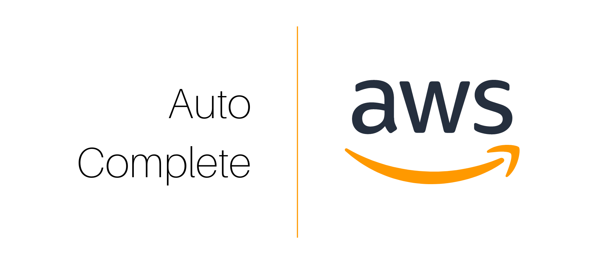

  

Open-source application to programmatically delete AWS resources based on a whitelist and time to live (TTL) settings

Auto Cleanup is comprised of three systems, app, web, and API. Click through to learn more and follow the steps to deploy the systems to your environment

|  |  |  |
| :--------------------------------: | :--------------------------------: | :--------------------------------: |
|    deletes abandoned resources     |      enables user interaction      |            exposes data            |
