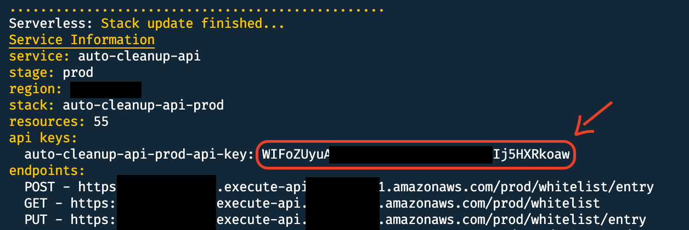
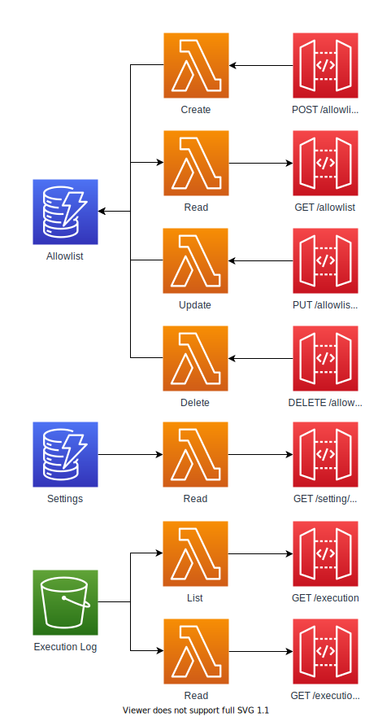

# AWS Auto Cleanup API

The AWS Auto Cleanup API is a serverless Lambda-based API built to facilitate the website. The architecture diagram below illustrates the various services and their relationships.

## Table of contents

- [Deployment](#deployment)
- [Removal](#removal)
- [Architecture](#architecture)
- [API](#api)

## Deployment

1. Ensure the [APP module](../app) has been deployed and invoked at least once prior to deploying this module

2. Change directory

   ```bash
   cd aws-auto-cleanup/api/
   ```

3. Install dependencies

   ```bash
   npm install
   ```

4. Deploy

   ```bash
   npm run deploy -- [--region] [--aws-profile]
   ```

5. After the deployment has completed, annotate the api key as it's the x-api-key needed to call the API and to use in the web app.
   

## Removal

1. Change directory

   ```bash
   cd aws-auto-cleanup/api/
   ```

2. Remove

   ```bash
   npm run remove -- [--region] [--aws-profile]
   ```

## Architecture



## API

- [Allowlist](#allowlist)
- [Execution Log](#execution-log)
- [Service](#service)

### Allowlist

#### Create

Inserts a new allowlist entry into DynamoDB.

**URL**: `/allowlist/entry`

**Method**: `POST`

**Auth required**: `x-api-key`

**Permissions required**: None

##### Request Syntax

```json
{
  "resource_id": "string",
  "owner": "string",
  "comment": "string",
  "permanent": "bool"
}
```

##### Request Structure

- _(dict)_

  - **resource_id** (string) -- **[REQUIRED]** Unique resource ID in format `service:resource:id`. For a list of acceptable values, [see this table](https://github.com/servian/aws-auto-cleanup#allowlist).

  - **owner** (string) -- The email address belonging to the owner of the allowlist entry.

  - **comment** (string) -- Comment associated with the allowlist entry.

  - **permanent** (bool) -- If the allowlist entry should be created as a permanent.

##### Return type

dict

##### Returns

###### Response Syntax

```json
{
  "message": "string",
  "request": {
    "resource_id": "string",
    "owner": "string",
    "comment": "string"
  },
  "response": {
    "resource_id": "string",
    "expiration": "epoch",
    "owner": "string",
    "comment": "string"
  }
}
```

###### Response Structure

- _(dict)_

  - **message** (string) -- If the operation was successful, the value will denote the action taken. Otherwise, the value will contain an error message.

  - **request** (dict) -- Request payload.

  - **response** (dict) -- Response payload.

    - **resource_id** (string) -- Allowlist entry resource ID.

    - **expiration** (epoch) -- Epoch timestamp when the allowlist entry will expire.

    - **owner** (string) -- The name or email address belonging to the owner of the allowlist entry.

    - **comment** (string) -- Comment associated with the allowlist entry.

##### Notes

- AWS service (e.g. `s3`) and resource (e.g. `bucket`) will be evaluated against the Settings table to ensure they are valid.

- The `expiration` field is computed at insert time. Current time plus `ttl` from the Settings table are used to compute the value.

#### Read

Returns the entire allowlist table.

**URL**: `/allowlist`

**Method**: `GET`

**Auth required**: `x-api-key`

**Permissions required**: None

##### Request Syntax

N/A

##### Request Structure

N/A

##### Return type

dict

##### Returns

###### Response Syntax

```json
{
  "message": "string",
  "request": null,
  "response": {
    "allowlist": [
      {
        "resource_id": "string",
        "expiration": "epoch",
        "owner": "string",
        "comment": "string"
      }
    ]
  }
}
```

###### Response Structure

- _(dict)_

  - **message** (string) -- If the operational was successful, the value will denote the action taken. Otherwise, the value will contain an error message.

  - **request** (dict) -- Request payload.

  - **response** (dict) -- Response payload.

    - **allowlist** (list) -- List of all allowlist entries.

      - _(dict)_

        - **resource_id** (string) -- Allowlist entry resource ID.

        - **expiration** (epoch) -- Epoch timestamp when the allowlist entry will expire.

        - **owner** (string) -- The name or email address belonging to the owner of the allowlist entry.

        - **comment** (string) -- Comment associated with the allowlist entry.

#### Update

Updates an existing allowlist entry into DynamoDB. This is not meant to be used to update the `owner` or `comment` fields, but rather to extend the `expiration` date to ensure the resources are kept alive for longer.

**URL**: `/allowlist/entry`

**Method**: `PUT`

**Auth required**: `x-api-key`

**Permissions required**: None

##### Request Syntax

```json
{
  "resource_id": "string",
  "expiration": "epoch",
  "owner": "string",
  "comment": "string"
}
```

##### Request Structure

- _(dict)_

  - **resource_id** (string) -- **[REQUIRED]** Unique resource ID in format `service:resource:id`. For a list of acceptable values, [see this table](https://github.com/servian/aws-auto-cleanup#allowlist).

  - **expiration** (epoch) -- **[REQUIRED]** Epoch timestamp of the existing allowlist entry.

  - **owner** (string) -- The name or email address belonging to the owner of the allowlist entry.

  - **comment** (string) -- Comment associated with the allowlist entry.

##### Return type

dict

##### Returns

###### Response Syntax

```json
{
  "message": "string",
  "request": {
    "resource_id": "string",
    "expiration": "epoch",
    "owner": "string",
    "comment": "string"
  },
  "response": {
    "resource_id": "string",
    "expiration": "epoch",
    "owner": "string",
    "comment": "string"
  }
}
```

###### Response Structure

- _(dict)_

  - **message** (string) -- If the operational was successful, the value will denote the action taken. Otherwise, the value will contain an error message.

  - **request** (dict) -- Request payload.

  - **response** (dict) -- Response payload.

    - **resource_id** (string) -- Allowlist entry resource ID.

    - **expiration** (epoch) -- Extended Epoch timestamp when the allowlist entry will expire.

    - **owner** (string) -- The name or email address belonging to the owner of the allowlist entry.

    - **comment** (string) -- Comment associated with the allowlist entry.

##### Notes

- AWS service (e.g. `s3`) and resource (e.g. `bucket`) will be evaluated against the Settings table to ensure they are valid.

- The new `expiration` field value is computed by using the value from the payload and adding to it the `ttl` value from the Settings table.

#### Delete

Deletes a new allowlist entry into DynamoDB.

**URL**: `/allowlist/entry`

**Method**: `DELETE`

**Auth required**: `x-api-key`

**Permissions required**: None

##### Request Syntax

```json
{
  "resource_id": "string"
}
```

##### Request Structure

- _(dict)_

  - **resource_id** (string) -- **[REQUIRED]** Unique resource ID in format `service:resource:id`. For a list of acceptable values, [see this table](https://github.com/servian/aws-auto-cleanup#allowlist).

##### Return type

dict

##### Returns

###### Response Syntax

```json
{
  "message": "string",
  "request": {
    "resource_id": "string"
  },
  "response": {
    "resource_id": "string"
  }
}
```

###### Response Structure

- _(dict)_

  - **message** (string) -- If the operational was successful, the value will denote the action taken. Otherwise, the value will contain an error message.

  - **request** (dict) -- Request payload.

  - **response** (dict) -- Response payload.

    - **resource_id** (string) -- Allowlist entry resource ID that was deleted.

### Execution Log

#### List

Returns a list of all Auto Cleanup App executions in descending order

**URL**: `/execution`

**Method**: `GET`

**Auth required**: `x-api-key`

**Permissions required**: None

##### Request Syntax

N/A

##### Request Structure

N/A

##### Return type

dict

##### Returns

###### Response Syntax

```json
{
  "message": "string",
  "request": null,
  "response": { "logs": [{ "key": "string", "date": "string" }] }
}
```

###### Response Structure

- _(dict)_

  - **message** (string) -- If the operational was successful, the value will denote the action taken. Otherwise, the value will contain an error message.

  - **request** (dict) -- Request payload.

  - **response** (list) -- Response payload.

    - **logs** (list) -- List of all execution logs.

      - _(dict)_

        - **key** (string) -- S3 key.

        - **date** (string) -- Locale’s appropriate date and time representation.

#### Read

Returns executions logs for a particular Auto Cleanup execution log S3 key.

**URL**: `/execution/{key}`

**Method**: `GET`

**Auth required**: `x-api-key`

**Permissions required**: None

##### Request Syntax

`{key}`

##### Request Structure

- **key** -- **[REQUIRED]** S3 key, URL encoded.

##### Return type

dict

##### Returns

###### Response Syntax

```json
{
  "message": "string",
  "request": { "key": "string" },
  "response": {
    "header": ["string"],
    "body": [["string"]] // or Base64 encoded zlib compressed JSON object,
    "statistics": { "key": { "key": "string" } },
    "is_compressed": "boolean",
    "is_dry_run": "boolean"
  }
}
```

###### Response Structure

- _(dict)_

  - **message** (string) -- If the operational was successful, the value will denote the action taken. Otherwise, the value will contain an error message.

  - **request** (dict) -- Request payload.

  - **response** (list) -- Response payload.

    - _(dict)_

      - **header** (list) -- List of column headers.

        - _string_

      - **body** (list) -- List of execution log records.

        - _(list)_

          - _string_

      - **statistics** (dict) -- Statistics for the execution log.

        - _(dict)_

          - **key** (string) -- Key for the statistics.

          - **string** (string) -- Value for the statistics.

      - **is_compressed** (boolean) -- Whether the execution log is compressed.

      - **is_dry_run** (boolean) -- Whether the execution log is a dry run.

### Service

#### Read

Returns a list AWS services that are supported by Auto Cleanup.

**URL**: `/settings/service`

**Method**: `GET`

**Auth required**: `x-api-key`

**Permissions required**: None

##### Request Syntax

N/A

##### Request Structure

N/A

##### Return type

dict

##### Returns

###### Response Syntax

```json
{
  "message": "string",
  "request": null,
  "response": {
    "string": { "string": { "clean": bool, "ttl": 123, "id": "string" } }
  }
}
```

###### Response Structure

- _(dict)_

  - **message** (string) -- If the operational was successful, the value will denote the action taken. Otherwise, the value will contain an error message.

  - **request** (dict) -- Request payload.

  - **response** (dict) -- Response payload.

    - _service (dict)_

      - _resource (dict)_

        - **clean** (boo) -- Indicator if the AWS service resource will be cleaned

        - **ttl** (123) -- Default time-to-live for the AWS service resource

        - **id** (string) -- Type of resource ID required for allowlisting
