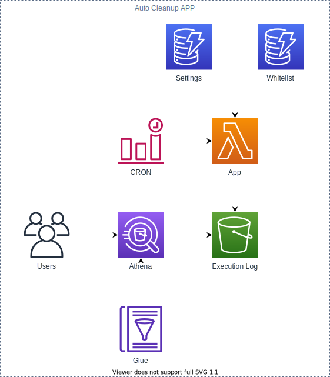

# AWS Auto Cleanup App

The AWS Auto Cleanup App consists of several serverless AWS resources that all work together to find and delete AWS resources that may have been abandoned. The architecture diagram below illustrates the various services and their relationships.

In its simplest form, the AWS Auto Cleanup App is a serverless AWS Lambda Function triggered by a CloudWatch Event Rule every three days. The Lambda Function then queries the AWS API to find all resources that are either not allowlisted or have exceeded their time-to-live time frame before deleting them.

AWS Auto Cleanup App can run independently of the API and WEB modules.

## Table of contents

- [Deployment](#deployment)
- [Removal](#removal)
- [Architecture](#architecture)
- [Features](#features)
  - [Allowlist](#allowlist)
    - [Resource ID](#resource-id)
    - [Expiration](#expiration)
  - [Settings](#settings)
    - [Version](#version)
    - [General](#general)
    - [Services](#services)
    - [Regions](#regions)
  - [Execution Log](#execution-log)
    - [Athena](#athena)
  - [Schedule](#schedule)

## Deployment

1. Install [AWS CLI](https://aws.amazon.com/cli/)

   ```bash
   pip install awscli
   ```

2. [Quickly Configuring the AWS CLI](https://docs.aws.amazon.com/cli/latest/userguide/cli-chap-configure.html#cli-quick-configuration)

   - _Auto Cleanup should be deployed by a user with administrative privileges._

3. Install [Serverless Framework](https://www.serverless.com/)

   ```bash
   npm install -g serverless
   ```

4. Download

   ```bash
   git clone https://github.com/servian/aws-auto-cleanup.git
   ```

5. Change directory

   ```bash
   cd aws-auto-cleanup/app/
   ```

6. Install dependencies

   ```bash
   npm install
   ```

7. Deploy

   ```bash
   npm run deploy -- [--region] [--aws-profile]
   ```

8. Run

   ```shell
   npm run invoke -- [--region] [--aws-profile]
   ```

   - _Settings and Allowlist tables will be populated at the start of the first run._

   - _Dry run mode is automatically activated by default._

9. Inspect

   ```bash
   npm run logs -- [--region] [--aws-profile]
   ```

## Removal

1. Change directory

   ```bash
   cd aws-auto-cleanup/app/
   ```

2. Remove

   ```bash
   npm run remove -- [--region] [--aws-profile]
   ```

   - _S3 buckets provisioned by Serverless will not be deleted through this process. To finalise removal, please delete the `athena-results` and `execution-log` buckets manually._

## Architecture



## Features

### Allowlist

The allowlist table (DynamoDB) maintains a record of all AWS resources that have been allowlisted (and therefore preserved). During the execution of Auto Cleanup, the scanned resources will be checked against the allowlist. If the resource exists within the allowlist table, it will not be deleted. Users are responsible for ensuring that the allowlist is up to date with the resources that they wish to preserve. This can be achieved manually by inserting records into the DynamoDB table or by using the AWS Auto Cleanup Web application.

The allowlist table adheres to the following schema:

| Column      | Format                      | Description                                                                                                                                                      |
| ----------- | --------------------------- | ---------------------------------------------------------------------------------------------------------------------------------------------------------------- |
| resource_id | `<service>:<resource>:<id>` | Unique identifier of the resource.<br>This is a custom format base on the<br>service (e.g., `ec2`, `s3`), the resource<br>(e.g., `instance`, `bucket`) and `id`. |
| expiration  | Epoch timestamp             | Epoch timestamp when the record<br>will be removed from the settings table                                                                                       |
| comment     | Text field                  | Comment field describing the resource<br>and why it has been allowlisted                                                                                         |
| owner       | Text field                  | Email address or name of the resource<br>owner in case they need to be contacted<br>regarding the allowlisting                                                   |

#### Resource ID

The `resource_id` field within the allowlist table holds a unique identifier for the allowlisted AWS resource. Due to some limitations with AWS, ARNs are not a viable unique identifier for all AWS resources and therefore an alternative identifier was created.

The below table indicates AWS resources that are supported by Auto Cleanup along with indications and examples of `resource_id` values for each resource.

| Resource                       | ID Attribute             | Example Value                                         |
| ------------------------------ | ------------------------ | ----------------------------------------------------- |
| Airflow Environments           | Environment Name         | `airflow:environment:environment_name`                |
| Amplify Apps                   | App Name                 | `amplify:app:app_name`                                |
| CloudFormation Stacks          | Stack Name               | `cloudformation:stack:stack_name`                     |
| CloudWatch Log Groups          | Log Group Name           | `cloudwatch:log_group:log_group_name`                 |
| DynamoDB Tables                | Table Name               | `dynamodb:table:table_name`                           |
| EC2 Elastic IPs                | Allocation ID            | `ec2:address:allocation_id`                           |
| EC2 Images                     | Image ID                 | `ec2:image:image_id`                                  |
| EC2 Instances                  | Instance ID              | `ec2:instance:instance_id`                            |
| EC2 NAT Gateways               | NAT Gateway ID           | `ec2:nat_gateway:nat_gateway_id`                      |
| EC2 Security Groups            | Group ID                 | `ec2:security_group:group_id`                         |
| EC2 Snapshots                  | Snapshot ID              | `ec2:snapshot:snapshot_id`                            |
| EC2 Volumes                    | Volume ID                | `ec2:volume:volume_id`                                |
| ECR Images                     | Image Digest             | `ecr:image:image_digest`                              |
| ECR Repositories               | Repository Name          | `ecr:repository:repository_name`                      |
| ECS Clusters                   | Cluster Name             | `ecs:cluster:cluster_name`                            |
| ECS Services                   | Service Name             | `ecs:service:service_name`                            |
| EFS File Systems               | File System ID           | `efs:file_system:file_system_id`                      |
| EKS Clusters                   | Cluster Name             | `eks:cluster:cluster_name`                            |
| EKS Fargate Profiles           | Fargate Profile Name     | `eks:fargate_profile:fargate_profile_name`            |
| EKS Node Groups                | Node Group Name          | `eks:node_group:node_group_name`                      |
| Elastic Beanstalk Applications | Application Name         | `elastic_beanstalk:application:application_name`      |
| ElastiCache Clusters           | Cache Cluster ID         | `elasticache:cluster:cache_cluster_id`                |
| ElastiCache Replication Groups | Replication Group ID     | `elasticache:replication_group:replication_group_id`  |
| Elasticsearch Service          | Domain Name              | `elasticsearch_service:domain:domain_name`            |
| ELB Load Balancers             | Load Balancer Name       | `elb:load_balancer:load_balancer_name`                |
| EMR Clusters                   | Job Flow ID              | `emr:cluster:job_flow_id`                             |
| Glue Crawlers                  | Crawler Name             | `glue:crawler:crawler_name`                           |
| Glue Databases                 | Database Name            | `glue:database:database_name`                         |
| Glue Dev Endpoints             | Endpoint Name            | `glue:dev_endpoint:endpoint_name`                     |
| IAM Access Keys                | Access Key ID            | `iam:access_key:access_key_id`                        |
| IAM Policies                   | Policy Name              | `iam:policy:policy_name`                              |
| IAM Roles                      | Role Name                | `iam:role:role_name`                                  |
| IAM Users                      | User Name                | `iam:user:user_name`                                  |
| Kafka Clusters                 | Cluster Name             | `kafka:cluster:cluster_name`                          |
| KMS Keys                       | Key ID                   | `kms:key:key_id`                                      |
| Kinesis Streams                | Stream Name              | `kinesis:stream:stream_name`                          |
| Lambda Functions               | Function Name            | `lambda:function:function_name`                       |
| RDS Clusters                   | DB Cluster Identifier    | `rds:cluster:db_cluster_identifier`                   |
| RDS Cluster Snapshots          | DB Cluster Snapshot Name | `rds:cluster_snapshot:db_cluster_snapshot_identifier` |
| RDS Instances                  | DB Instance Identifier   | `rds:instance:db_instance_identifier`                 |
| RDS Snapshots                  | DB Snapshot Name         | `rds:snapshot:db_snapshot_identifier`                 |
| Redshift Clusters              | Cluster Identifier       | `redshift:instance:cluster_identifier`                |
| Redshift Snapshots             | Snapshot Identifier      | `redshift:snapshot:snapshot_identifier`               |
| S3 Buckets                     | Bucket Name              | `s3:bucket:bucket_name`                               |
| SageMaker Apps                 | App Name                 | `sagemaker:app:app_name`                              |
| SageMaker Endpoints            | Endpoint Name            | `sagemaker:endpoint:endpoint_name`                    |
| SageMaker Notebook Instances   | Notebook Instance Name   | `sagemaker:notebook_instance:notebook_instance_name`  |
| Transfer Servers               | Server ID                | `transfer:server:server_id`                           |

_Note: Resources that are a part of a CloudFormation Stack will be automatically allowlisted at run time to prevent the need to allowlist the CloudFormation Stack and each resource the Stack provisions._

##### Wildcard

Resource IDs can be specified with wildcards. The following table indicates the wildcard characters that can be used when definining your resource ID.

| Pattern | Meaning                          |
| ------- | -------------------------------- |
| \*      | matches everything               |
| ?       | matches any single character     |
| [seq]   | matches any character in seq     |
| [!seq]  | matches any character not in seq |

#### Expiration

The `expiration` field within the allowlist table is marked as a TTL field. This means that when the current timestamp exceeds the value within the `expiration` field, DynamoDB will remove the record from the table.

This has been designed in such a way as to prevent AWS resources from being allowlisted indefinitely.

### Settings

The settings table contains several key-value pairs records including `version`, `general`, `services`, and `regions`.

#### Version

The version number of the settings. If the version number within the `app/src/data/auto-cleanup-settings.json` file is greater than in the database, the settings will be refreshed.

| Key     | Value |
| ------- | ----- |
| Version | 123   |

#### General

General settings.

| Key     | Value |
| ------- | ----- |
| Dry Run | True  |

#### Services

Service-specific settings indicating the supported AWS services, resources, and their lifespan.

| Service               | Resource Type      | Clean | TTL | Comment                                                                                                                                                                             |
| --------------------- | ------------------ | ----- | --- | ----------------------------------------------------------------------------------------------------------------------------------------------------------------------------------- |
| Airflow               | Environments       | True  | 7   |                                                                                                                                                                                     |
| Amplify               | Apps               | True  | 7   |                                                                                                                                                                                     |
| CloudFormation        | Stacks             | True  | 7   | Deletes Stack if not allowlisted or not part of a allowlisted nested Stack.                                                                                                         |
| CloudWatch            | Log Groups         | True  | 30  |                                                                                                                                                                                     |
| DynamoDB              | Tables             | True  | 7   |                                                                                                                                                                                     |
| EC2                   | Elastic IPs        | True  | N/A | Deletes Address if not associated with an EC2 instance.                                                                                                                             |
| EC2                   | Images             | True  | 7   |                                                                                                                                                                                     |
| EC2                   | Instances          | True  | 7   |                                                                                                                                                                                     |
| EC2                   | NAT Gateways       | True  | 7   |                                                                                                                                                                                     |
| EC2                   | Security Groups    | True  | N/A | Deletes Security Group if not associated with an EC2 instance.                                                                                                                      |
| EC2                   | Snapshots          | True  | 7   |                                                                                                                                                                                     |
| EC2                   | Volumes            | True  | 7   | Volumes that are attached to an EC2 Instance when it launched will be deleted if the EC2 Instance is terminated. This is an AWS behaviour and not something that can be controlled. |
| ECR                   | Images             | True  | 7   |                                                                                                                                                                                     |
| ECR                   | Repositories       | True  | 7   | Deletes Repository if no Images exist.                                                                                                                                              |
| ECS                   | Clusters           | True  | N/A | Deletes Cluster if no running Services or Tasks.                                                                                                                                    |
| ECS                   | Services           | True  | 7   |                                                                                                                                                                                     |
| EFS                   | File Systems       | True  | 7   |                                                                                                                                                                                     |
| EKS                   | Clusters           | True  | 7   | Deletes Cluster if no Fargate Profiles or Node Groups exist.                                                                                                                        |
| EKS                   | Fargate Profiles   | True  | 7   |                                                                                                                                                                                     |
| EKS                   | Node Groups        | True  | 7   |                                                                                                                                                                                     |
| Elastic Beanstalk     | Applications       | True  | 7   |                                                                                                                                                                                     |
| ElastiCache           | Clusters           | True  | 7   |                                                                                                                                                                                     |
| ElastiCache           | Replication Groups | True  | 7   |                                                                                                                                                                                     |
| Elasticsearch Service | Domain Name        | True  | 7   |                                                                                                                                                                                     |
| ELB                   | Load Balancers     | True  | 7   |                                                                                                                                                                                     |
| EMR                   | Clusters           | True  | 7   |                                                                                                                                                                                     |
| Glue                  | Crawlers           | True  | 7   |                                                                                                                                                                                     |
| Glue                  | Databases          | True  | 30  |                                                                                                                                                                                     |
| Glue                  | Dev Endpoints      | True  | 7   |                                                                                                                                                                                     |
| IAM                   | Access Keys        | True  | 30  |                                                                                                                                                                                     |
| IAM                   | Policies           | True  | 30  |                                                                                                                                                                                     |
| IAM                   | Roles              | True  | 30  |                                                                                                                                                                                     |
| IAM                   | Users              | True  | 30  |                                                                                                                                                                                     |
| Kafka                 | Clusters           | True  | 7   |                                                                                                                                                                                     |
| Kinesis               | Streams            | True  | 7   |                                                                                                                                                                                     |
| KMS                   | Keys :new:         | True  | 7   |                                                                                                                                                                                     |
| Lambda                | Functions          | True  | 30  |                                                                                                                                                                                     |
| RDS                   | Clusters           | True  | 7   | Deletes Cluster and all DB Instances present within the Cluster.                                                                                                                    |
| RDS                   | Cluster Snapshots  | True  | 7   |                                                                                                                                                                                     |
| RDS                   | Instances          | True  | 7   |                                                                                                                                                                                     |
| RDS                   | Snapshots          | True  | 7   |                                                                                                                                                                                     |
| Redshift              | Clusters           | True  | 7   |                                                                                                                                                                                     |
| Redshift              | Snapshots          | True  | 7   |                                                                                                                                                                                     |
| S3                    | Buckets            | True  | 30  |                                                                                                                                                                                     |
| SageMaker             | Apps               | True  | 7   |                                                                                                                                                                                     |
| SageMaker             | Endpoints          | True  | 7   |                                                                                                                                                                                     |
| SageMaker             | Notebook Instances | True  | 7   |                                                                                                                                                                                     |
| Transfer              | Servers            | True  | N/A | Deletes any Servers running that are not allowlisted. The AWS API does not provide creation dates for Servers.                                                                      |

#### Regions

Region-specific settings indicating the regions to be cleaned.

| Region            | Clean |
| ----------------- | ----- |
| af-south-1        | True  |
| ap-east-1         | True  |
| ap-northeast-1    | True  |
| ap-northeast-2    | True  |
| ap-northeast-3 \* | False |
| ap-south-1        | True  |
| ap-southeast-1    | True  |
| ap-southeast-2    | True  |
| ca-central-1      | True  |
| cn-north-1 \*     | False |
| cn-northwest-1 \* | False |
| eu-central-1      | True  |
| eu-north-1        | True  |
| eu-south-1        | True  |
| eu-west-1         | True  |
| eu-west-2         | True  |
| eu-west-3         | True  |
| me-south-1        | True  |
| sa-east-1         | True  |
| us-east-1         | True  |
| us-east-2         | True  |
| us-west-1         | True  |
| us-west-2         | True  |

_Note: Some regions are deactivated by default as they require special access from AWS._

### Execution Log

Post every Auto Cleanup run, an execution log is generated and stored as a flat CSV file within the `execution-log` S3 Bucket. The execution log files adhere to the following schema.

| Column       | Format    | Description                                                                                                                                            |
| ------------ | --------- | ------------------------------------------------------------------------------------------------------------------------------------------------------ |
| platform     | string    | Always `AWS`                                                                                                                                           |
| region       | string    | Region (e.g. `ap-southeast-2`)                                                                                                                         |
| service      | string    | Service (e.g., `s3`)                                                                                                                                   |
| resource     | string    | Resource (e.g., `bucket`)                                                                                                                              |
| resource_id  | string    | Resource ID (e.g., Instance ID)                                                                                                                        |
| action       | string    | Action taken on the resource (e.g., `DELETE`, `DELETE - NOT CONFIRMED`, `SKIP - TTL`, `SKIP - ALLOWLIST`, `SKIP - IN USE`, `SKIP - STATE`, OR `ERROR`) |
| timestamp    | timestamp | Timestamp when action was performed                                                                                                                    |
| dry_run_flag | boolean   | Dry run activated                                                                                                                                      |
| execution_id | string    | Lambda execution ID                                                                                                                                    |

#### Execution Log Actions

List actions that may be taken on the resources.

| Action                 | Description                                                                                                                                                            |
| ---------------------- | ---------------------------------------------------------------------------------------------------------------------------------------------------------------------- |
| DELETE                 | Resource will be deleted.                                                                                                                                              |
| DELETE - NOT CONFIRMED | Assigned to CloudFormation stacks that will be deleted, but which the cleanup is not able to confirm deletion for due to how long they can potentially take to delete. |
| SKIP - TTL             | Resource will not be deleted since it is lower than the time to live (TTL) set for the resource.                                                                       |
| SKIP - ALLOWLIST       | Resource will not be deleted since it is part of the allowlist.                                                                                                        |
| SKIP - IN USE          | Resource will not be deleted since it is in use by another resource.                                                                                                   |
| SKIP - STATE           | Assigned to KMS keys that are in a state other than Enabled.                                                                                                           |
| ERROR                  | There was an error detecting / deleting the resource.                                                                                                                  |

#### Athena

To enable analytical access to the generated execution logs, a Glue Database and Glue Table are provisioned based on the S3 Bucket and file schema of the execution log. This database and table can be accessed directly from within Athena enabling the logs to be queried using SQL.

### Schedule

By default, the Auto Cleanup Lambda is scheduled to run every three days from the time of deployment. You can manually trigger the app to run by executing the `npm run invoke` command found in the Deployment section above.

You can change the schedule by modifying the `serverless.yml` file and changing `rate: rate(3 days)` to whatever rate you want.
