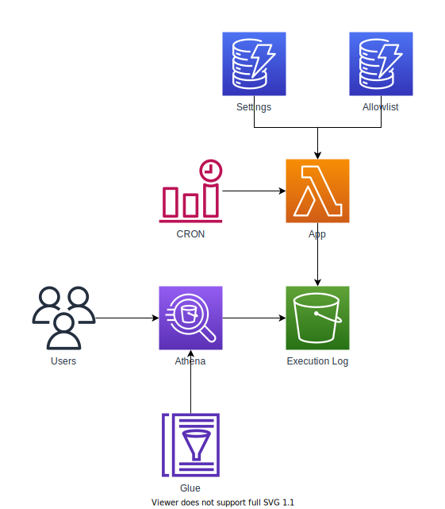

# AWS Auto Cleanup Application

The Auto Cleanup Application consists of several serverless AWS resource that all work together to find, and delete AWS resources that may have been abandoned. The architecture diagram below illustrates the various services and their relationships with one another.



## Table of contents

- [Deployment](#deployment)
- [Removal](#removal)
- [Features](#features)
  - [Whitelist](#whitelist)
  - [Settings](#settings)
  - [Execution Log](#execution-log)

## Deployment

1. Install [AWS CLI](https://aws.amazon.com/cli/)

   ```bash
   pip install awscli
   ```

2. [Quickly Configuring the AWS CLI](https://docs.aws.amazon.com/cli/latest/userguide/cli-chap-configure.html#cli-quick-configuration)

   - _Auto Cleanup should be deployed by a user with administrative privileges._

3. Install [Serverless Framework](https://www.serverless.com/)

   ```bash
   npm install serverless
   ```

4. Download

   ```bash
   serverless create -u https://github.com/servian/aws-auto-cleanup/tree/master/app --p aws-auto-cleanup-app
   ```

5. Change directory

   ```bash
   cd aws-auto-cleanup-app
   ```

6. Install dependencies

   - Node

     ```bash
     npm install
     ```

   - Python

     ```bash
     pip install -r ./util/dynamodb_json/requirements.txt -t ./util/dynamodb_json/python/lib/python3.8/site-packages/ --no-deps
     ```

7. Deploy

   ```bash
   serverless deploy [--region] [--aws-profile]
   ```

8. Run

   ```shell
   serverless invoke --function AutoCleanup [--region] [--aws-profile] --type Event
   ```

   - _Settings and Whitelist tables will be populated at the start of the first run._

   - _Dry run mode is automatically activated by default._

9. Inspect

   ```bash
   serverless logs --function AutoCleanup [--region] [--aws-profile]
   ```

## Removal

1. Change directory

   ```bash
   cd aws-auto-cleanup-app
   ```

2. Remove

   ```bash
   serverless remove [--region] [--aws-profile]
   ```

   - _S3 buckets provisioned by Serverless will not be deleted through this process. To finalise removal, please delete the `athena-results` and `execution-log` buckets manually._

## Features

### Whitelist

The whitelist table (DynamoDB) maintains a record of all AWS resources that have been whitelisted (and therefore preserved). During the execution of Auto Cleanup, the scanned resources will be checked against the whitelist. If the resource exists within the whitelist table, it will not be deleted.

The whitelist table adheres to the following schema:

| Column      | Format                      | Description                                                                                                                                                      |
| ----------- | --------------------------- | ---------------------------------------------------------------------------------------------------------------------------------------------------------------- |
| resource_id | `<service>:<resource>:<id>` | Unique identifier of the resource.<br>This is a custom format base on the<br>service (e.g., `ec2`, `s3`), the resource<br>(e.g., `instance`, `bucket`) and `id`. |
| expiration  | EPOCH timestamp             | EPOCH timestamp when the record<br>will be removed from the settings table                                                                                       |
| comment     | Text field                  | Comment field describing the resource<br>and why it has been whitelisted                                                                                         |
| owner       | Text field                  | Email address or name of the resource<br>owner in case they need to be contacted<br>regarding the whitelisting                                                   |

#### Resource ID

The `resource_id` field within the whitelist table holds a unique identifier for the whitelisted AWS resource. Due to some limitations with AWS, ARNs are not a viable unique identifier for all AWS resources and therefore an alternative was identifier was created.

The below table indicates AWS resources that are supported by Auto Cleanup along with indications and examples of `resource_id` values for each resource.

| Resource                       | ID Attribute           | Example Value                                        |
| ------------------------------ | ---------------------- | ---------------------------------------------------- |
| CloudFormation Stacks          | Stack Name             | `cloudformation:stack:stack_name`                    |
| DynamoDB Tables                | Table Name             | `dynamodb:table:table_name`                          |
| EC2 Elastic IPs                | Allocation ID          | `ec2:address:allocation_id`                          |
| EC2 Instances                  | Instance ID            | `ec2:instance:instance_id`                           |
| EC2 Security Groups            | Group ID               | `ec2:security_group:group_id`                        |
| EC2 Snapshots                  | Snapshot ID            | `ec2:snapshot:snapshot_id`                           |
| EC2 Volumes                    | Volume ID              | `ec2:volume:volume_id`                               |
| ECS Clusters                   | Cluster Name           | `ecs:cluster:cluster_name`                           |
| ECS Services                   | Service Name           | `ecs:service:service_name`                           |
| Elastic Beanstalk Applications | Application Name       | `elasticbeanstalk:application:application_name`      |
| EMR Clusters                   | ID                     | `emr:cluster:id`                                     |
| Glue Dev Endpoints             | Endpoint Name          | `glue:dev_endpoint:endpoint_name`                    |
| IAM Roles                      | Role Name              | `iam:role:role_name`                                 |
| Kinesis Streams                | Stream Name            | `kinesis:stream:stream_name`                         |
| Lambda Functions               | Function Name          | `lambda:function:function_name`                      |
| Redshift Instances             | Cluster Identifier     | `redshift:instance:cluster_identifier`               |
| Redshift Snapshots             | Snapshot Identifier    | `redshift:snapshot:snapshot_identifier`              |
| RDS Instances                  | DB Instance Identifier | `rds:instance:db_instance_identifier`                |
| RDS Snapshots                  | DB Snapshot Name       | `rds:snapshot:db_snapshot_name`                      |
| S3 Buckets                     | Bucket Name            | `s3:bucket:bucket_name`                              |
| SageMaker Endpoints            | Endpoint Name          | `sagemaker:endpoint:endpoint_name`                   |
| SageMaker Notebook Instances   | Notebook Instance Name | `sagemaker:notebook_instance:notebook_instance_name` |

_Note: Resources that are a part of a CloudFormation Stack will be automatically whitelisted at run time to prevent the need to whitelist the CloudFormation Stack and each resource the Stack provisions._

#### Expiration

The `expiration` field within the whitelist table is marked as a TTL field. This means that when the current timestamp exceeds the value within the `expiration` field, DynamoDB will remove the record from the table.

This has been designed in such a way as to prevent AWS resources from being whitelisted indefinitely.

### Settings

The settings table contains several key-value pairs records including `version`, `general`, `services`, and `regions`.

#### Version

Version number of the settings. If the version number within the `app/src/data/auto-cleanup-settings.json` file is greater than in the database, the settings will be refreshed.

| Key     | Value |
| ------- | ----- |
| Version | 123   |

#### General

General settings.

| Key     | Value |
| ------- | ----- |
| Dry Run | True  |

#### Services

Service-specific settings. This includes which services and resources are cleaned, and how long they can remain active within AWS before Auto Cleanup deletes them.

| Service           | Resource Type            | Clean | TTL | Comment                                                        |
| ----------------- | ------------------------ | ----- | --- | -------------------------------------------------------------- |
| CloudFormation    | Stacks                   | True  | 7   |                                                                |
| DynamoDB          | Tables                   | True  | 7   |                                                                |
| EC2               | Addresses                | True  | N/A | Deletes Address if not associated with an EC2 instance.        |
| EC2               | Instances                | True  | 7   |                                                                |
| EC2               | Security Groups          | True  | N/A | Deletes Security Group if not associated with an EC2 instance. |
| EC2               | Snapshots                | True  | 7   |                                                                |
| EC2               | Volumes                  | True  | 7   |                                                                |
| ECS               | Clusters :new:           | True  | N/A | Deletes Cluster if no running Services or Tasks.               |
| ECS               | Services :new:           | True  | 7   |                                                                |
| Elastic Beanstalk | Applications             | True  | 7   |                                                                |
| EMR               | Clusters                 | True  | 7   |                                                                |
| Glue              | Dev Endpoints            | True  | 7   |                                                                |
| IAM               | Roles                    | True  | 30  |                                                                |
| Kinesis           | Streams :new:            | True  | 7   |                                                                |
| Lambda            | Functions                | True  | 30  |                                                                |
| RDS               | Instances                | True  | 7   |                                                                |
| RDS               | Snapshots                | True  | 7   |                                                                |
| Redshift          | Clusters                 | True  | 7   |                                                                |
| Redshift          | Snapshots                | True  | 7   |                                                                |
| S3                | Buckets                  | True  | 30  |                                                                |
| SageMaker         | Endpoints :new:          | True  | 7   |                                                                |
| SageMaker         | Notebook Instances :new: | True  | 7   |                                                                |

#### Regions

Region-specific settings. This includes which regions are cleaned, and which are skipped.

| Region            | Clean |
| ----------------- | ----- |
| af-south-1        | True  |
| ap-east-1         | True  |
| ap-northeast-1    | True  |
| ap-northeast-2    | True  |
| ap-northeast-3 \* | False |
| ap-south-1        | True  |
| ap-southeast-1    | True  |
| ap-southeast-2    | True  |
| ca-central-1      | True  |
| cn-north-1 \*     | False |
| cn-northwest-1 \* | False |
| eu-central-1      | True  |
| eu-north-1        | True  |
| eu-south-1        | True  |
| eu-west-1         | True  |
| eu-west-2         | True  |
| eu-west-3         | True  |
| me-south-1        | True  |
| sa-east-1         | True  |
| us-east-1         | True  |
| us-east-2         | True  |
| us-west-1         | True  |
| us-west-2         | True  |

_Note: Some regions have `clean` set to `False` by default as they required special access from AWS._

### Execution Log

Post every Auto Cleanup run, an execution log is generated and stored as a flat CSV file within the `execution-log` S3 Bucket. The execution log files adhere to the following schema.

| Column       | Format    | Description                                                                                         |
| ------------ | --------- | --------------------------------------------------------------------------------------------------- |
| platform     | string    | Always `AWS`                                                                                        |
| region       | string    | Region (e.g. `ap-southeast-2`)                                                                      |
| service      | string    | Service (e.g., `s3`)                                                                                |
| resource     | string    | Resource (e.g., `bucket`)                                                                           |
| resource_id  | string    | Resource ID (e.g., Instance ID)                                                                     |
| action       | string    | Action taken on the resource (e.g., `delete`, `skip - TTL`, `skip - whitelist`, `skip`, or `error`) |
| timestamp    | timestamp | Timestamp when action was performed                                                                 |
| dry_run_flag | boolean   | Dry run activated                                                                                   |
| execution_id | string    | Lambda execution ID                                                                                 |

#### Athena

To enable analytical access to the generated execution logs, a Glue Database and Glue Table are provisioned based on the S3 Bucket and file schema of the execution log. This database and table can be accessed directly from within Athena enabling the logs to be queried using SQL.
