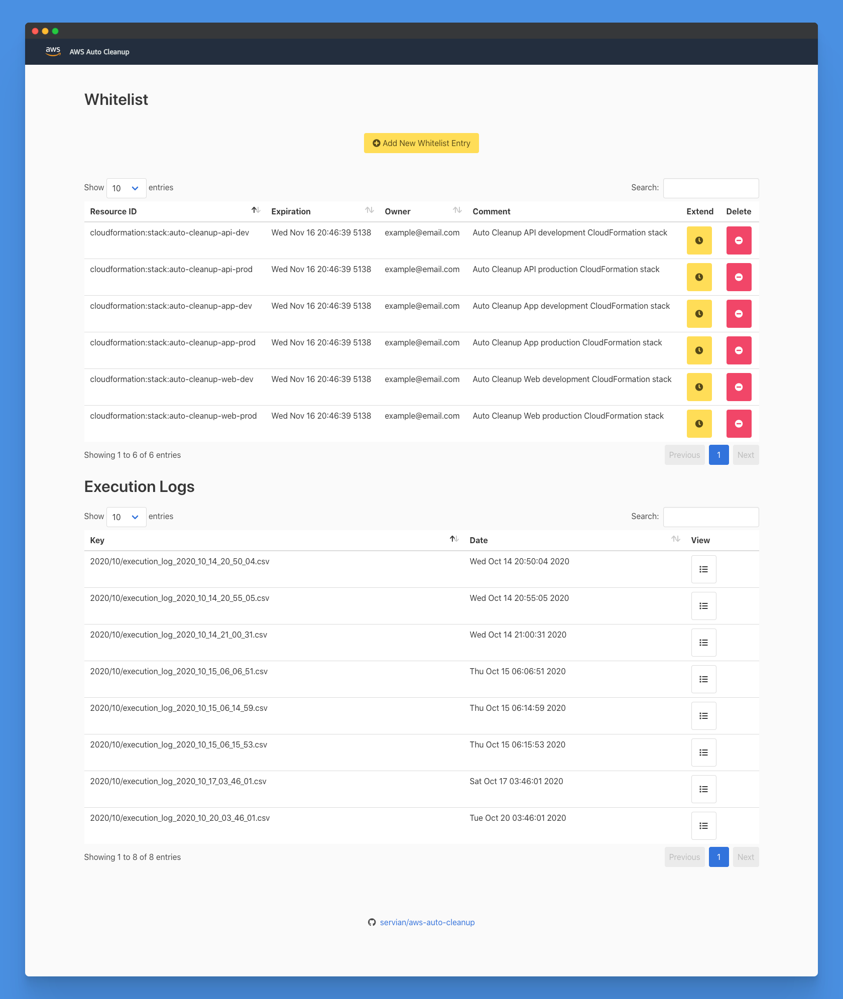

# AWS Auto Cleanup Website

The Auto Cleanup Website is a static Vue.js website hosted within Amazon S3. The website utilises the Auto Cleanup API to serve content and enable user interaction.


## Table of contents

- [Table of contents](#table-of-contents)
- [Deployment](#deployment)
- [Removal](#removal)
- [Screenshots](#screenshots)

## Deployment

1. Install [AWS CLI](https://aws.amazon.com/cli/)

   ```bash
   pip install awscli
   ```

2. [Quickly Configuring the AWS CLI](https://docs.aws.amazon.com/cli/latest/userguide/cli-chap-configure.html#cli-quick-configuration)

   - _Auto Cleanup should be deployed by a user with administrative privileges._

3. Install [Serverless Framework](https://www.serverless.com/)

   ```bash
   npm install -g serverless
   ```

4. Download

   ```bash
   git clone https://github.com/servian/aws-auto-cleanup.git
   ```

5. Change directory

   ```bash
   cd aws-auto-cleanup/web/
   ```

6. Deploy

   ```bash
   npm run deploy -- [--region] [--aws-profile]
   ```

7. Deploy

   ```bash
   npm run deploy-client -- [--region] [--aws-profile]
   ```

## Removal

1. Change directory

   ```bash
   cd aws-auto-cleanup-web
   ```

2. Remove

   ```bash
   npm run remove-client -- [--region] [--aws-profile]
   ```

3. Remove

   ```bash
   npm run remove -- [--region] [--aws-profile]
   ```

## Screenshots


