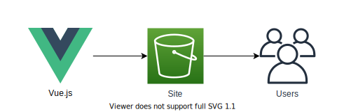

# AWS Auto Cleanup Website

The Auto Cleanup Website is a static Vue.js website hosted within Amazon S3. The website utilises the Auto Cleanup API to serve content and enable user interaction.



## Table of contents

- [Table of contents](#table-of-contents)
- [Deployment](#deployment)
- [Removal](#removal)
- [Screenshots](#screenshots)

## Deployment

1. Ensure the [API module](../api) has been deployed prior to deploying this module

2. Change directory

   ```bash
   cd aws-auto-cleanup/web/
   ```
   
3. Install dependencies

   ```bash
   npm install
   ```

4. Deploy infrastructure

   ```bash
   npm run deploy -- [--region] [--aws-profile]
   ```

5. Deploy website

   ```bash
   npm run deploy:client -- [--region] [--aws-profile]
   ```

## Removal

1. Change directory

   ```bash
   cd aws-auto-cleanup/web/
   ```

2. Remove website

   ```bash
   npm run remove:client -- [--region] [--aws-profile]
   ```

3. Remove infrastructure

   ```bash
   npm run remove -- [--region] [--aws-profile]
   ```

## Screenshots

|  |  |
| :------------------------: | :----------------------: |
|         dashboard          |   add whitelist entry    |

|  |  |
| :----------------------------: | :----------------------: |
|     delete whitelist entry     |      execution logs      |
